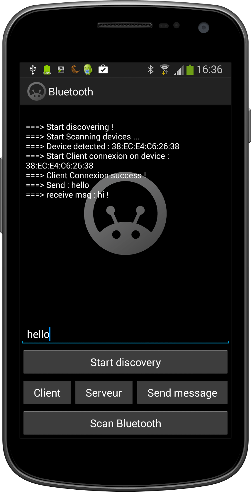
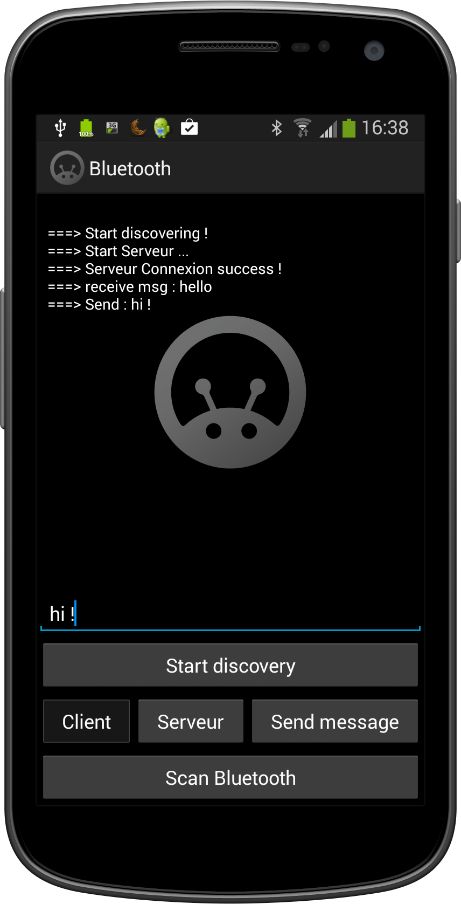

Android Bluetooth Library
=====================




```java
 public class MainActivity extends BluetoothActivity {
    @Override
    public void onCreate(Bundle savedInstanceState) {
        super.onCreate(savedInstanceState);
        setContentView(R.layout.activity_main);
    }

    @Override
    protected void onStart() {
        super.onStart();
        setTimeDiscoverable(200);
        startDiscovery();
    }

    @Override
    public void onBluetoothStartDiscovery() {
    }

    @Override
    public void onBluetoothDeviceFound(BluetoothDevice device) {
    }

    @Override
    public void onClientConnectionSuccess() {
    }

    @Override
    public void onClientConnectionFail() {
    }

    @Override
    public void onServeurConnectionSuccess() {
    }

    @Override
    public void onServeurConnectionFail() {
    }

    @Override
    public void onBluetoothCommunicator(String messageReceive) {
    }

    @Override
    public void onBluetoothNotAviable() {
    }
}
```

Download
--------

Download [the latest JAR][2]

License
-------

    Copyright 2014 Rami Martin

    Licensed under the Apache License, Version 2.0 (the "License");
    you may not use this file except in compliance with the License.
    You may obtain a copy of the License at

       http://www.apache.org/licenses/LICENSE-2.0

    Unless required by applicable law or agreed to in writing, software
    distributed under the License is distributed on an "AS IS" BASIS,
    WITHOUT WARRANTIES OR CONDITIONS OF ANY KIND, either express or implied.
    See the License for the specific language governing permissions and
    limitations under the License.
    
    
[2]: https://github.com/arissa34/Bluetooth-Library/blob/master/Bluetooth/Bluetooth_lib/jar/Bluetooth_library_v1.0.0.jar
